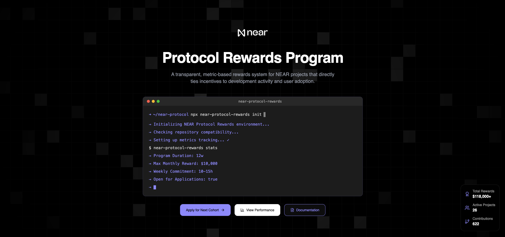

# NEAR Protocol Rewards Landing Page



> The official landing page for NEAR Protocol Rewards - a transparent, metric-based rewards system that directly ties incentives to development activity in the NEAR ecosystem.

[](https://opensource.org/licenses/MIT)

## Overview

This repository contains the landing page for the [NEAR Protocol Rewards program](https://github.com/near-horizon/near-protocol-rewards), showcasing how we're transforming traditional one-time grants into sustainable, ongoing capital for developers in the NEAR ecosystem. The landing page provides information about our merit-based rewards system that automatically tracks and rewards development activity.

## Features

- 📊 Interactive dashboard preview
- 🔄 Real-time metrics visualization
- 📱 Responsive design for all devices
- 🎨 Modern UI with Tailwind CSS
- 🔒 TypeScript for type safety

## Quick Start

### Prerequisites

- Node.js (v16 or higher)
- npm or yarn
- Git

### Installation

1. Clone the repository:
```bash
git clone https://github.com/jbarnes850/protocol-rewards-landing.git
cd protocol-rewards-landing
```

2. Install dependencies:
```bash
npm install
# or
yarn install
```

3. Set up environment variables:
```bash
cp .env.example .env
```

4. Start the development server:
```bash
npm run dev
# or
yarn dev
```

The site will be available at `http://localhost:3000`

## Development

### Tech Stack

- TypeScript
- React
- Tailwind CSS
- Next.js

### Project Structure

```
protocol-rewards-landing/
├── public/          # Static assets
├── src/             # Source code
│   ├── components/  # React components
│   ├── pages/       # Next.js pages
│   ├── styles/      # Global styles
│   └── utils/       # Utility functions
├── tests/           # Test files
└── docs/            # Documentation
```

### Contributing

1. Fork the repository
2. Create your feature branch (`git checkout -b feature/amazing-feature`)
3. Commit your changes (`git commit -m 'Add some amazing feature'`)
4. Push to the branch (`git push origin feature/amazing-feature`)
5. Open a Pull Request

## Related Resources

- [NEAR Protocol Rewards Main Repository](https://github.com/near-horizon/near-protocol-rewards)
- [Documentation](https://github.com/near-horizon/near-protocol-rewards/tree/main/docs)
- [Rewards Dashboard](https://www.nearprotocolrewards.com/dashboard)

## License

This project is licensed under the MIT License - see the [LICENSE](LICENSE) file for details.

## Support

For support, please:
- Open an [issue](https://github.com/jbarnes850/protocol-rewards-landing/issues)
